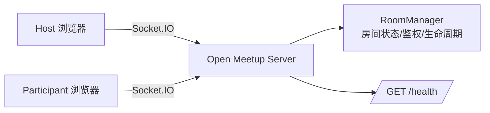

# Open Meetup

> 一个开源的实时会议协作 Demo，基于 **React + Socket.IO + TypeScript**。  
> 支持多人加入、主持人流程控制、断线重连与会话恢复。

## ✨ 核心能力

- 实时创建 / 加入会议（6 位房间号）
- 主持人流程控制（开始、下一步、结束）
- 服务端鉴权（`roomId + userId + sessionId`）
- 断线自动重连与会话恢复（`localStorage` 持久化会话）
- 在线 / 离线状态同步
- 房间生命周期管理（主持人离开 / 超时自动关闭）

## 🔐 安全与稳定性设计

- 服务端不信任客户端 `hostId`，主持权限统一在服务端判断
- 重连必须携带合法 `sessionId`，避免身份伪造
- Socket ACK 超时保护，避免前端请求无响应卡死
- 离线用户宽限清理（默认 2 分钟），防止脏会话长期占用房间

## 🧱 技术栈

- **Client**: React 18、Vite 5、TypeScript、TailwindCSS、Socket.IO Client
- **Server**: Node.js、Express、Socket.IO、TypeScript

## 🏗️ 架构概览



## 🚀 快速开始

### 1) 环境要求

- Node.js **>= 18**
- npm **>= 9**

### 2) 安装依赖

在项目根目录执行：

```bash
npm install
```

### 3) 启动开发环境

```bash
npm run dev
```

默认地址：

- 前端：`http://localhost:5173`
- 后端：`http://localhost:3001`
- 健康检查：`http://localhost:3001/health`

### 4) 构建

```bash
npm run build
```

## 🧪 典型使用流程

1. 主持人在首页输入昵称，创建房间
2. 分享 6 位房间号给参与者
3. 参与者输入昵称 + 房间号加入
4. 主持人点击「开始会议」后推进步骤
5. 若网络闪断，页面会自动尝试会话恢复

## ⚙️ 环境变量

### Server

| 变量名 | 默认值 | 说明 |
| --- | --- | --- |
| `PORT` | `3001` | 服务端端口 |
| `HOST` | `0.0.0.0` | 服务监听地址 |

### Client

| 变量名 | 默认值 | 说明 |
| --- | --- | --- |
| `VITE_SERVER_URL` | `http://localhost:3001` | Socket/HTTP 服务端地址 |
| `VITE_SOCKET_ACK_TIMEOUT_MS` | `6000` | Socket ACK 超时毫秒数 |

## 📜 脚本说明

### 根目录

| 命令 | 说明 |
| --- | --- |
| `npm run dev` | 同时启动前后端开发服务 |
| `npm run dev:server` | 启动后端开发服务 |
| `npm run dev:client` | 启动前端开发服务 |
| `npm run build` | 构建前后端 |
| `npm run install:all` | 安装根目录 + 子项目依赖 |

### Server（`server/`）

| 命令 | 说明 |
| --- | --- |
| `npm run dev` | ts-node-dev 热更新启动 |
| `npm run build` | TypeScript 编译 |
| `npm run start` | 启动编译产物 |

### Client（`client/`）

| 命令 | 说明 |
| --- | --- |
| `npm run dev` | 启动 Vite 开发服务 |
| `npm run build` | 构建前端 |
| `npm run preview` | 本地预览构建产物 |

## 🔌 Socket 事件约定

### Client → Server

- `room:create`
- `room:join`
- `room:reconnect`
- `room:leave`
- `control:start`
- `control:next`
- `control:end`
- `state:sync-request`

### Server → Client

- `session:restored`
- `room:user-joined`
- `room:user-left`
- `room:user-online`
- `room:user-offline`
- `state:sync`
- `control:started`
- `control:next`
- `control:ended`
- `room:closed`

## ❗ 常见错误码

- `BAD_REQUEST`
- `ROOM_NOT_FOUND`
- `ROOM_CLOSED`
- `ROOM_FULL`
- `NOT_AUTHENTICATED`
- `NOT_AUTHORIZED`
- `SESSION_EXPIRED`
- `MEETING_NOT_ACTIVE`
- `USER_NOT_FOUND`
- `INTERNAL_ERROR`

## 📁 项目结构

```text
open-meetup/
├── client/                 # React 前端
├── server/                 # Express + Socket.IO 服务端
├── package.json            # workspace 入口脚本
├── LICENSE
└── README.md
```

## 🗺️ Roadmap（欢迎共建）

- [ ] 邀请链接与密码房间
- [ ] 会议记录与回放
- [ ] 单元测试 / E2E 测试
- [ ] Docker 一键部署

## 🤝 贡献

欢迎提 Issue / PR：

1. Fork 仓库
2. 新建分支（`feat/xxx`）
3. 提交变更并附说明
4. 发起 Pull Request

## 📄 开源许可

本项目采用 [MIT License](./LICENSE)。
